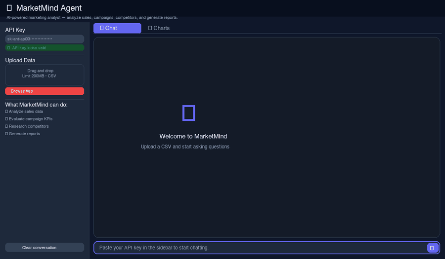
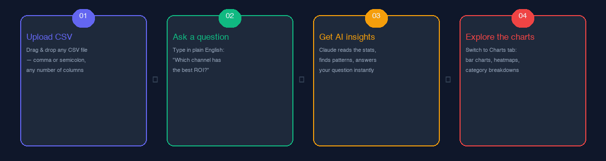
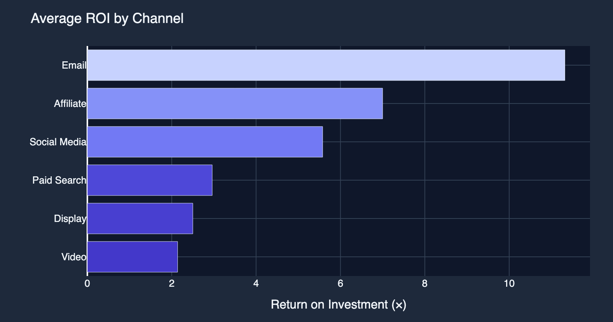
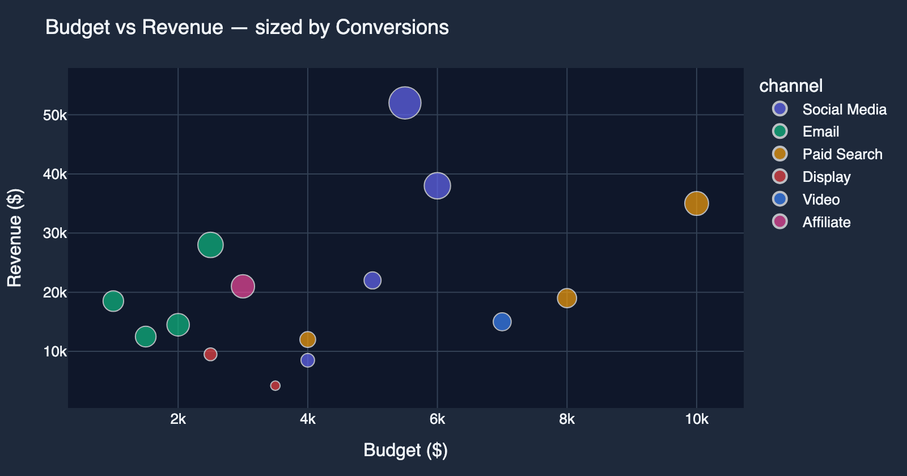
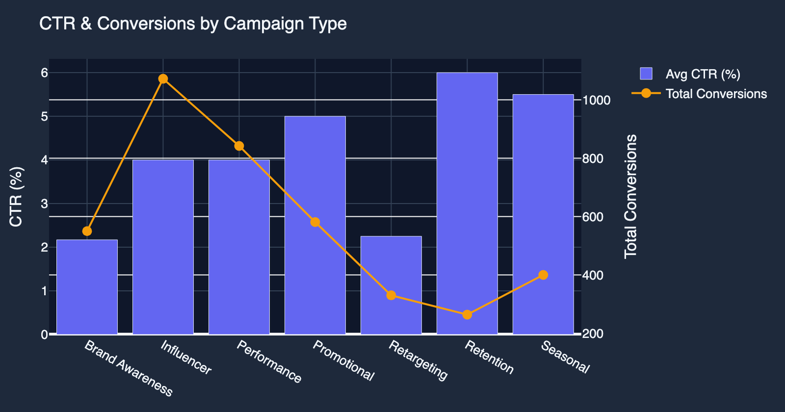
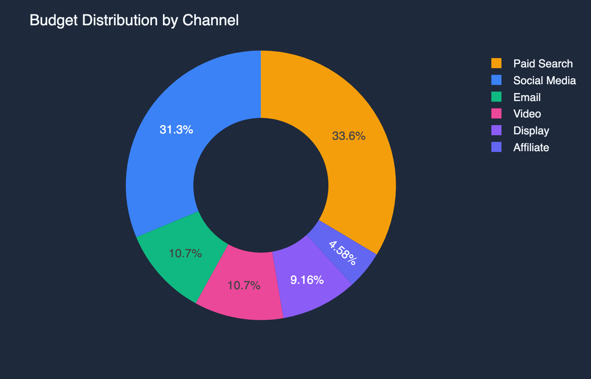
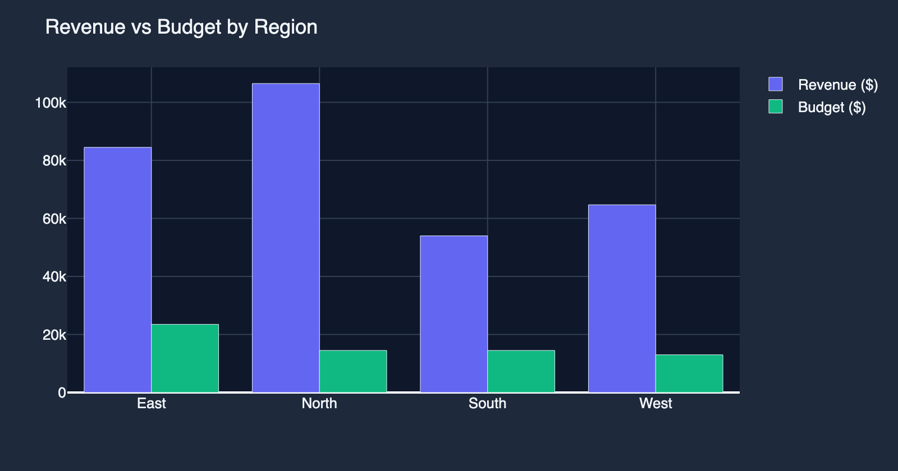
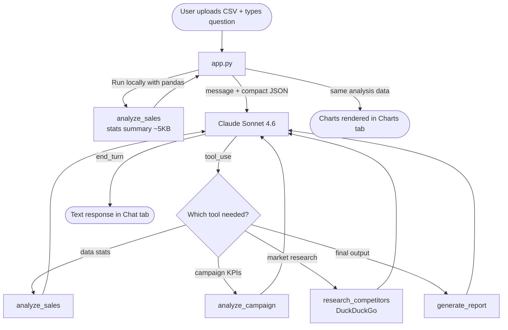

<div align="center">

# MarketMind

### AI-powered marketing analyst — upload a CSV, ask questions, get insights

[](https://python.org)
[](https://streamlit.io)
[](https://anthropic.com)
[](LICENSE)

<br/>



*Upload a CSV → ask a question → get AI insights → explore charts*

</div>

---

## The idea

I built this because every time someone asked "which channel is performing best?" it meant opening spreadsheets, writing pivot tables, and copy-pasting numbers into slides. That's a lot of effort for a question that should take 10 seconds.

MarketMind is a chat interface that sits on top of your data. You upload a CSV, ask questions in plain English, and get back numbers, trends, and interactive charts — no SQL, no dashboards, no learning curve.

---

## How it works



| Step | What happens |
|---|---|
| **1. Upload CSV** | Drag & drop any CSV — comma or semicolon separated, any columns, any size |
| **2. Ask a question** | Type in plain English — "which channel has the best ROI?" |
| **3. Get AI insights** | Claude analyzes the stats, finds patterns, and answers your question |
| **4. Explore charts** | Switch to the Charts tab for interactive bar charts, heatmaps, and more |

---

## The dashboard

**💬 Chat tab** — conversational AI that remembers context across follow-up questions

| Ask | What you get |
|---|---|
| *"Analyze this dataset"* | Full breakdown — stats, patterns, outliers, top performers |
| *"Which channel has the best ROI?"* | Direct answer with numbers and a recommendation |
| *"Where are we wasting budget?"* | Underperforming segments with actionable advice |
| *"Generate a report"* | Structured Markdown report ready to share |

**📊 Charts tab** — auto-generated visualizations from your data

**ROI by Channel**


**Budget vs Revenue — sized by Conversions**


**CTR & Conversions by Campaign Type**


**Budget Distribution by Channel**


**Revenue vs Budget by Region**


> All charts are interactive in the live app — hover for values, click the legend to filter.

---

## Architecture



The raw CSV is **never sent to the API**. It's analyzed locally with pandas first — only the compact stats (~5KB) go to Claude. That's what keeps response times fast even on large files.

---

## Features

| Feature | What it does |
|---|---|
| **CSV analysis** | Parses any tabular data — auto-detects `,` or `;` delimiters, handles UTF-8 BOM |
| **Campaign KPIs** | Calculates CTR, CPC, CPA, ROAS from your column names automatically |
| **Interactive charts** | Bar charts, scatter plots, heatmaps, pie charts — built from your actual data |
| **Competitor research** | Live web search for market intel, pricing, industry trends |
| **Report generation** | Structured Markdown reports ready to share with stakeholders |
| **Conversation memory** | Follow-up questions work — it remembers the full context |

---

## Project structure

```
MarketMind/
│
├── app.py                   # Streamlit UI — chat, charts, sidebar, session state
├── agent.py                 # Claude agentic loop — tool dispatch, history management
│
├── tools/
│   ├── sales.py             # CSV parser + pandas stats (mean, std, correlations)
│   ├── campaign.py          # KPI calculator — CTR, CPC, CPA, ROAS
│   ├── research.py          # DuckDuckGo web search
│   └── report.py            # Markdown / plain-text report builder
│
├── sample_data/
│   └── demo_campaigns.csv   # 15-row sample — try it immediately
│
├── docs/                    # Demo GIF, infographic, and chart screenshots
├── requirements.txt
└── .env                     # Your API key — never committed
```

---

## Getting started

### 1. Clone

```bash
git clone https://github.com/raselmian03-alt/MarketMind.git
cd MarketMind
```

### 2. Install dependencies

```bash
pip install -r requirements.txt
```

### 3. Add your API key

Create a `.env` file:

```
ANTHROPIC_API_KEY=sk-ant-api03-your-key-here
```

Get a free key at [console.anthropic.com](https://console.anthropic.com) → API Keys. A $5 credit is more than enough to get started.

### 4. Run

```bash
streamlit run app.py
```

Opens at `http://localhost:8501`

---

## Try it with the sample data

There's a 15-campaign demo CSV in `sample_data/demo_campaigns.csv`. Upload it and try:

- *"Analyze this dataset and give me the key insights"*
- *"Which channel has the highest ROI?"*
- *"Where are we wasting budget?"*
- *"Compare Email vs Social Media performance"*
- *"Generate a performance report"*

---

## Tech stack

| Layer | Tool |
|---|---|
| UI | Streamlit |
| AI | Claude Sonnet 4.6 (Anthropic) |
| Data | pandas + numpy |
| Charts | Plotly Express |
| Web search | duckduckgo-search |
| Config | python-dotenv |

---

## License

MIT — use it, fork it, build on it.

---

*Built for people who just want answers from their data, not another tool to learn.*
