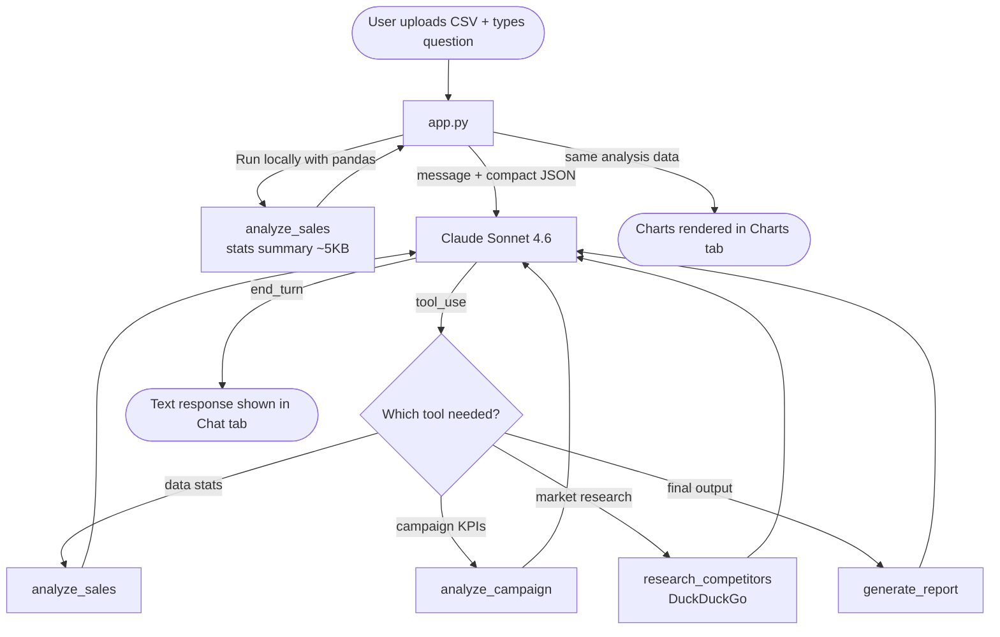

<div align="center">

# MarketMind

### AI-powered marketing analyst — upload a CSV, ask questions, get insights

[](https://python.org)
[](https://streamlit.io)
[](https://anthropic.com)
[](LICENSE)

</div>

---

## What is this?

I built this because every time someone asked "which channel is performing best?" it meant opening spreadsheets, writing pivot tables, and copy-pasting numbers into slides. That's a lot of effort for a question that should take 10 seconds.

MarketMind is a chat interface that sits on top of your data. You upload a CSV, ask questions in plain English, and get back numbers, trends, and interactive charts — no SQL, no dashboards, no learning curve.

---

## Demo

**Conversation example with the included sample dataset:**

```
You:   "Which channel has the best ROI?"

📊:    Email leads at 8.3× average ROI, closely followed by
       Affiliate (7.0×) and Social Media (6.2×).
       Display ads are underperforming at just 1.2× — worth
       reviewing that budget allocation before next quarter.

You:   "Which region should we focus on?"

📊:    North generates the highest total revenue ($98,500)
       with Email and Social driving most of it.
       West is underinvested — highest ROI-per-dollar but
       only 18% of total budget allocated there.

You:   "Generate a report I can share with my team"

📊:    # Q2 Campaign Performance Report
       Generated: 2026-04-26 11:00
       ...
```

---

## Charts — built automatically from your data

Upload any CSV and switch to the **📊 Charts** tab:

**ROI by Channel**


**Budget vs Revenue — sized by Conversions**


**CTR & Conversions by Campaign Type**


**Budget Distribution by Channel**


**Revenue vs Budget by Region**


> All charts are interactive in the app — hover for values, click legend to filter.

---

## Features

| Feature | What it does |
|---|---|
| **CSV analysis** | Parses any tabular data — auto-detects `,` or `;` delimiters, handles UTF-8 BOM |
| **Campaign KPIs** | Calculates CTR, CPC, CPA, ROAS from your column names automatically |
| **Interactive charts** | Bar charts, scatter plots, heatmaps, pie charts — built from your actual data |
| **Competitor research** | Live web search for market intel, pricing, industry trends |
| **Report generation** | Structured Markdown reports ready to share |
| **Conversation memory** | Follow-up questions work — it remembers the full context |

---

## How it works



The raw CSV is **never sent to the API**. It's analyzed locally first with pandas, and only the compact statistics go to Claude. That's what keeps it fast even on large files.

---

## Project structure

```
MarketMind/
│
├── app.py                   # Streamlit UI — chat, charts, sidebar, session state
├── agent.py                 # Claude agentic loop — tool dispatch, history management
│
├── tools/
│   ├── sales.py             # CSV parser + pandas stats (mean, std, correlations)
│   ├── campaign.py          # KPI calculator — CTR, CPC, CPA, ROAS
│   ├── research.py          # DuckDuckGo web search
│   └── report.py            # Markdown / plain-text report builder
│
├── sample_data/
│   └── demo_campaigns.csv   # 15-row sample — try it immediately, no data needed
│
├── docs/                    # Chart screenshots for this README
├── requirements.txt
└── .env                     # Your API key — never committed
```

---

## Getting started

### 1. Clone

```bash
git clone https://github.com/raselmian03-alt/MarketMind.git
cd MarketMind
```

### 2. Install dependencies

```bash
pip install -r requirements.txt
```

### 3. Add your API key

Create a `.env` file in the project root:

```
ANTHROPIC_API_KEY=sk-ant-api03-your-key-here
```

Get a free key at [console.anthropic.com](https://console.anthropic.com) → API Keys. $5 credit is more than enough to get started.

### 4. Run

```bash
streamlit run app.py
```

Opens at `http://localhost:8501`

---

## Try it with the sample data

There's a 15-campaign demo CSV in `sample_data/demo_campaigns.csv`. Upload it and try:

```
"Analyze this dataset and give me the key insights"
"Which channel has the highest ROI?"
"Where are we wasting budget?"
"Compare Email vs Social Media performance"
"Which region should we invest more in?"
"Generate a performance report"
```

---

## What questions can you ask?

**About your data:**
- *"Which campaign type converts best?"*
- *"What's the correlation between budget and revenue?"*
- *"Show me the top 5 campaigns by ROI"*
- *"Where are the biggest outliers?"*

**About the market (no CSV needed):**
- *"What are current trends in email marketing?"*
- *"How does Mailchimp compare to HubSpot on pricing?"*

**For reports:**
- *"Generate a formal report I can share with stakeholders"*

---

## Tech stack

| Layer | Tool | Reason |
|---|---|---|
| UI | Streamlit | Fast to build, clean out of the box |
| AI | Claude Sonnet 4.6 | Best reasoning on structured data |
| Data | pandas + numpy | Standard — nothing to debate here |
| Charts | Plotly Express | Interactive with one line of code |
| Web search | duckduckgo-search | No API key needed |
| Config | python-dotenv | Simple `.env` file management |

---

## License

MIT — use it, fork it, build on it.

---

*Built for people who just want answers from their data.*
