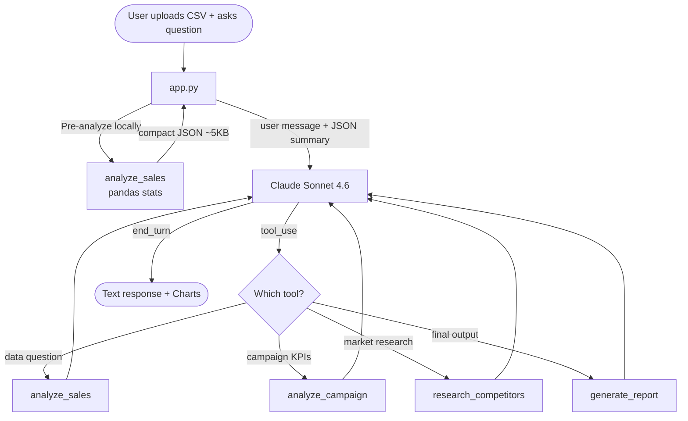

<div align="center">

# MarketMind

### AI-powered marketing analyst — just upload a CSV and start asking questions

[](https://python.org)
[](https://streamlit.io)
[](https://anthropic.com)
[](LICENSE)

</div>

---

## The idea

I built this because every time someone on the team asked "which channel is performing best?" it meant opening spreadsheets, writing pivot tables, and copy-pasting numbers into a slide. That's a lot of effort for a question that should take 10 seconds.

MarketMind is a chat interface that sits on top of your data. You upload a CSV, ask questions in plain English, and get back numbers, trends, and charts. No SQL, no dashboards, no learning curve.

---

## What it looks like

```
┌─────────────────────────────────────────────────────────────┐
│  📊 MarketMind Agent                                        │
├──────────────────┬──────────────────────────────────────────┤
│                  │  💬 Chat  │  📊 Charts                   │
│  API Key         ├──────────────────────────────────────────┤
│  ──────────      │                                          │
│  Upload CSV      │  You: Which channel has the best ROI?    │
│  ──────────      │                                          │
│  Loaded:         │  MarketMind: Email leads with an avg     │
│  campaigns.csv   │  ROI of 8.3×, followed by Social        │
│                  │  Media (6.2×) and Affiliate (7.0×).      │
│  What I can do:  │  Display ads trail significantly at      │
│  📈 Analyze data │  1.2× — worth reviewing that budget.     │
│  📣 Campaign KPIs│                                          │
│  🔍 Competitors  │  > Ask a follow-up...                    │
│  📝 Reports      │                                          │
└──────────────────┴──────────────────────────────────────────┘
```

Switch to the **Charts tab** and you get interactive Plotly visualizations — bar charts, category breakdowns, correlation heatmaps — automatically built from whatever CSV you uploaded.

---

## Features

| Feature | What it does |
|---|---|
| **CSV analysis** | Parses any tabular data — auto-detects comma or semicolon delimiters, handles UTF-8 BOM |
| **Campaign KPIs** | Calculates CTR, CPC, CPA, ROAS from your column names automatically |
| **Competitor research** | Live DuckDuckGo search for market intel, pricing, trends |
| **Report generation** | Structured Markdown reports you can paste straight into a doc |
| **Interactive charts** | Bar charts, heatmaps, categorical breakdowns — all from Plotly |
| **Conversation memory** | Remembers the full conversation so follow-up questions work naturally |

---

## How it works



The key design decision: the raw CSV never gets sent to the API. It's analyzed locally with pandas first, and only the compact statistics (~5KB) go to Claude. That's what keeps it fast even on large files.

---

## Project structure

```
MarketMind/
│
├── app.py                  # Streamlit UI — chat, charts, sidebar, session management
├── agent.py                # Claude agentic loop — tool dispatch, history sanitization
│
├── tools/
│   ├── sales.py            # CSV parser + pandas stats (mean, std, correlations, groups)
│   ├── campaign.py         # Marketing KPI calculator (CTR, CPC, CPA, ROAS)
│   ├── research.py         # DuckDuckGo web search wrapper
│   └── report.py           # Markdown / plain-text report builder
│
├── sample_data/
│   └── demo_campaigns.csv  # 15-row sample to try immediately
│
├── requirements.txt
├── .gitignore
└── .env                    # Your API key — never committed
```

---

## Getting started

### 1. Clone

```bash
git clone https://github.com/raselmian03-alt/MarketMind.git
cd MarketMind
```

### 2. Install dependencies

```bash
pip install -r requirements.txt
```

### 3. Set up your API key

Create a `.env` file:

```
ANTHROPIC_API_KEY=sk-ant-api03-your-key-here
```

Get a key at [console.anthropic.com](https://console.anthropic.com) → API Keys. A $5 credit is plenty to get started.

### 4. Run

```bash
streamlit run app.py
```

Opens at `http://localhost:8501`

---

## Try it with the sample data

There's a 15-campaign demo CSV in `sample_data/demo_campaigns.csv`. Upload it and try:

- *"Which channel has the highest ROI?"*
- *"What's the average CTR across all campaigns?"*
- *"Compare Social Media vs Email performance"*
- *"Which region should we focus on next quarter?"*
- *"Generate a summary report"*

---

## Example questions

**For campaign data:**
- *"Analyze this dataset and give me the key insights"*
- *"Which campaign type converts best?"*
- *"Where are we wasting budget?"*
- *"Show me the top 3 campaigns by revenue"*

**For market research (no CSV needed):**
- *"What are the latest trends in email marketing?"*
- *"How does HubSpot price its plans?"*

**For reports:**
- *"Generate a formal performance report I can share with stakeholders"*

---

## Tech stack

| | Tool | Why |
|---|---|---|
| UI | Streamlit | Fast to build, looks decent out of the box |
| AI | Claude Sonnet 4.6 | Best for reasoning over structured data |
| Data | pandas + numpy | Standard — no reason to use anything else |
| Charts | Plotly Express | Interactive with one line of code |
| Search | duckduckgo-search | No API key required |
| Config | python-dotenv | Simple `.env` file management |

---

## Supported CSV formats

- Comma-separated (`,`) and semicolon-separated (`;`)
- UTF-8 with or without BOM characters
- Marketing data, sales reports, product catalogs, survey results — any tabular data works

---

## License

MIT — use it, fork it, build on it.

---

*Built for people who just want answers from their data, not another tool to learn.*
